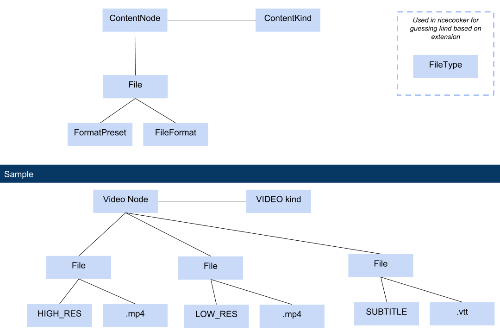

LE Utils
========
The `le-utils` package contains shared constants used by Ricecooker, Kolibri, and
Kolibri Studio. This package is not meant to be installed or used directly, but
plays an important role in all Learning Equality products.


Constants
=========
The Python files in the [le_utils/constants/](./le_utils/constants) are used to
define constants (usually in `ALL_CAPS` form) to be used from Python code.
The same constants and naming conventions are also provided in JSON format in the
folder [le_utils/resources/](le_utils/resources) for use in frontend code.
This means, adding a new constant may require editing multiple files: the Python
constant-defining file, the JSON-file, and any associated tests.


Languages
---------
The file [le_utils/constants/languages.py](./le_utils/constants/languages.py) and
the lookup table in [le_utils/resources/languagelookup.json](./le_utils/resources/languagelookup.json)
define the internal representation for languages codes used by Ricecooker, Kolibri,
and Kolibri Studio to identify educational content in different languages.

The internal representation uses a mixture of two-letter codes (e.g. `en`),
two-letter-and-country code (e.g. `pt-BR` for Brazilian Portuguese),
and three-letter codes (e.g., `zul` for Zulu).

In order to make sure you have the correct language code when interfacing with
the Kolibri ecosystem (e.g. when uploading new content to Kolibri Studio), you
must lookup the language object using the helper method `getlang`:

```python
>>> from le_utils.constants.languages import getlang
>>> language_obj = getlang('en')       # lookup language using language code
>>> language_obj
Language(native_name='English', primary_code='en', subcode=None, name='English', ka_name=None)
```
The function `getlang` will return `None` if the lookup fails. In such cases, you
can try lookup by name or lookup by alpha2 code (ISO_639-1) methods defined below.

Once you've successfully looked up the language object, you can obtain the internal
representation language code from the language object's `code` attribute:
```python
>>> language_obj.code
'en'
```
The Ricecooker API expects these internal representation language codes will be
supplied for all `language` attributes (channel language, node language, and files language).


### More lookup helper methods
The helper method `getlang_by_name` allows you to lookup a language by name:
```python
>>> from le_utils.constants.languages import getlang_by_name
>>> language_obj = getlang_by_name('English')  # lookup language by name
>>> language_obj
Language(native_name='English', primary_code='en', subcode=None, name='English', ka_name=None)
```

The module `le_utils.constants.languages` defines two other language lookup methods:
  - Use `getlang_by_native_name` for lookup up names by native language name,
    e.g., you look for 'Français' to find French.
 -  Use `getlang_by_alpha2` to perform lookups using the standard two-letter codes
    defined in [ISO_639-1](https://en.wikipedia.org/wiki/ISO_639-1) that are
    supported by the `pycountries` library.


#### Useful links

The following websites are usful for researching language codes:

  - https://www.ethnologue.com/
  - https://en.wikipedia.org/wiki/List_of_ISO_639-2_codes


Licenses
--------
All content nodes within Kolibri and Kolibri Studio must have a license. The file
[le_utils/constants/licenses.py](./le_utils/constants/licenses.py) contains the
constants used to identify the license types. These constants are meant to be
used in conjunction with the helper method `ricecooker.classes.licenses.get_license`
to create `Licence` objects.

To initialize a license object, you must specify the license type and the
`copyright_holder` (str) which identifies a person or an organization. For example:
```python
from ricecooker.classes.licenses import get_license
from le_utils.constants import licenses
license = get_license(licenses.CC_BY, copyright_holder="Khan Academy")
```

Note: The `copyright_holder` field is required for all License types except for
the public domain license for which `copyright_holder` can be None.


Content kinds (ContentNode subclasses)
--------------------------------------
Content items throughout the Kolibri ecosystem come in several kinds. The `kind`
attribute of each object can be one of ("topic", "video", "audio", "exercise"
"document", or "html5".
See [constants/content_kinds.py](https://github.com/learningequality/le-utils/blob/master/le_utils/constants/content_kinds.py#L11-L17) for latest list.

The currently supported content kinds are:
  - Topic node (folder)
  - Video content nodes backed by a video files and subtitles
  - Audio content nodes backed by an audio files
  - Document content nodes backed by a document files (PDF or ePub)
  - HTML5 app content nodes backed by a HTML5 zip files
  - Slideshow content nodes
  - Exercise content nodes

The `kind` attribute identifies a subclass of the base content node class within
the data model, which differs on Ricecooker, Studio, and Kolibri:
  - [ricecooker.classes.nodes.ContentNode](https://github.com/learningequality/ricecooker/blob/master/ricecooker/classes/nodes.py#L428-L506):
    in-memory content node used to store metadata needed to upload new content to Kolibri  Studio
  - [contentcuration.contentcuration.models.ContentNode](https://github.com/learningequality/studio/blob/develop/contentcuration/contentcuration/models.py#L775):
    node within one of the trees associated with a Kolibri Studio channel.
  - [kolibri.core.content.models.ContentNode](https://github.com/learningequality/kolibri/blob/develop/kolibri/core/content/models.py#L175):
    node within tree for a particular version of a channel on Kolibri.

For a detailed description of the common and different model attributes available
on content nodes in each part of the platform see [this doc](https://docs.google.com/spreadsheets/d/181hSEwJ7yVmMh7LEwaHENqQetYSsbSDwybHTO_0zZM0/edit#gid=1640972430).


File formats (extensions)
-------------------------
These are low-level constant that represents what type of file and are essentially
synonymous with file extensions. The file format `MP4` is simply a convenient 
proxy for the file extension `mp4`. 
See [file_formats.py](https://github.com/learningequality/le-utils/blob/master/le_utils/constants/file_formats.py)
and [resources/formatlookup.json](https://github.com/learningequality/le-utils/blob/master/le_utils/resources/formatlookup.json).


Format presets (ContentNode-File relation)
------------------------------------------
Every `ContentNode` is associated with one or more `File` objects and nature of
this association is represented though the `format_preset` attribute of the file.
The `format_preset` is the role the file is playing in the content node,
e.g., thumbnail, high resolution video, or low resolution video.
Note that format presets are represented redundantly as python string in 
[constants/format_presets.py](https://github.com/learningequality/le-utils/blob/master/le_utils/constants/format_presets.py)
and as json [resources/presetlookup.json](https://github.com/learningequality/le-utils/blob/master/le_utils/resources/presetlookup.json).

You can think of the different format presets on a content node as different "slots"
to be filled in by files, with certain slots being required while other optional.
For examples, for a VideoNode (kind=`video`) to be a valid content node, it must
have at least one video file associated with it filling either the `high_res_video`
slot or the `low_res_video` slot. Certain slots can have multiple files in them,
like the `video_subtitle` preset, since a VideoNode can have multiple subtitles
associated with it for different languages.


The figure below illustrates the structure between content nodes, files, and format presets.



In the Sample shown, the Video Node is of content kind `video` and has three
files associated with it:
  - The first file has file format `mp4` and format preset `high_res_video`
  - The second file is also in `mp4` format but the relation to the content node
    is that `low_res_video`
  - A third file with format `vtt` is associated with the content node with a
    format preset of `video_subtitle`.

Format presets play a crucial role throughout the Kolibri content ecosystem and
govern such things as content validation rules applied by Ricecooker, Kolibri Studio
edit rules, and the rendering logic on Kolibri.


File types (ricecooker.files.File subclasses)
---------------------------------------------
Used on Ricecooker as identifiers to represents what type of file when serializing
things to JSON as part of the content import process. Note that file types constants
are internal to ricecooker operations and are not used in Kolibri Studio or Kolibri.


Exercises
---------
The file [le_utils/constants/exercises.py](./le_utils/constants/exercises.py)
contains identifiers for different question types and mastery models.


Proquint Channel Tokens
-----------------------
The file [le_utils/proquint.py](./le_utils/proquint.py) contains helper methods
for generating proquint identifiers for content channels. These are short strings
that are easy to enter on devices without a full keyboard, e.g. `sutul-hakuh`.


Roles
-----
The `role` constants are used for Role-based access control (RBAC) within the
Kolibri platform. Currently, only two levels of visibility are supported:
  - `learner` (default): content nodes are visible to all Kolibri users
  - `coach`: content nodes are only visible to Kolibri coaches and administrators

